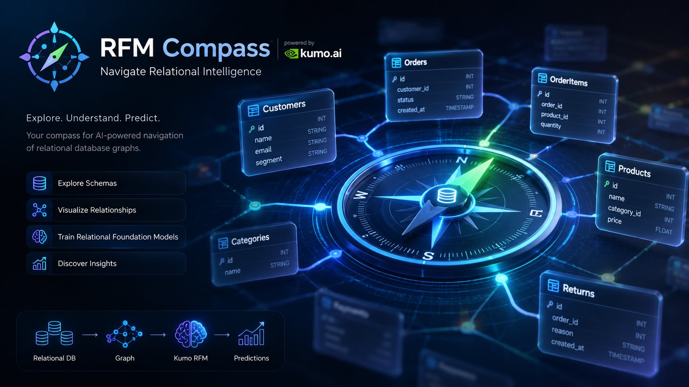
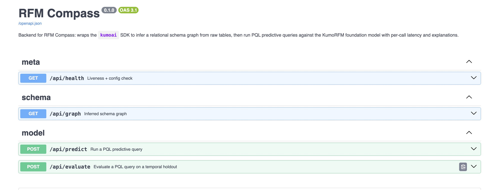
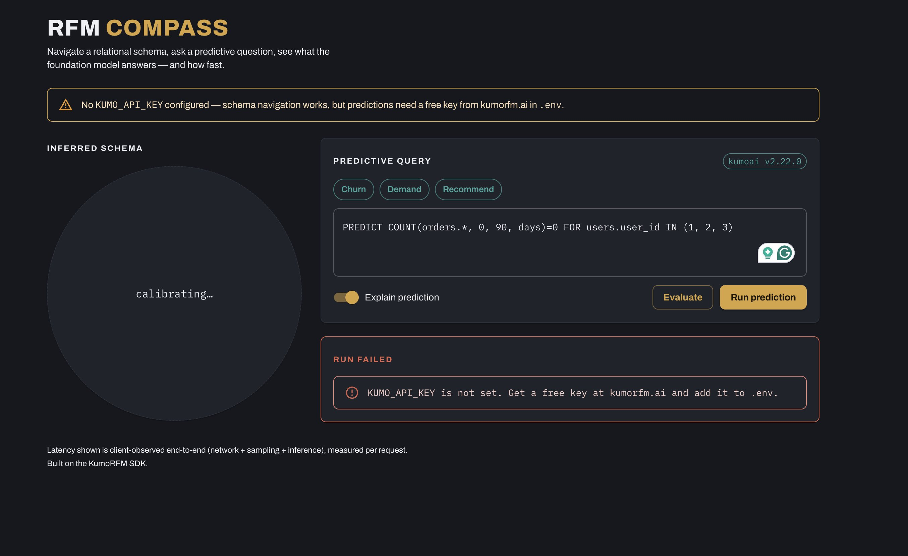

# RFM Compass 🧭

> Navigate relational data with Relational Foundation Models(RFM).
> 
> 

Ask predictive questions in **PQL**, explore your relational schema as a graph, and understand how **Relational Foundation Models (RFMs)** arrive at their predictions through visual explanations and end-to-end latency metrics.

---

## Why RFM Compass?

RFM Compass is an open-source exploration tool for **NVIDIA Kumo Relational Foundation Models**.

Instead of treating relational databases as isolated tables, RFM Compass helps you visualize how entities are connected, formulate predictive queries, and understand the relationships the model learns from.

Whether you're learning RFMs or building production workflows, Compass provides an intuitive way to inspect the complete prediction pipeline.

---

## ⚡ Getting Started

### ⚙️ Install Dependencies

```bash
# Boostrap the project: Create .venv and upgrade pip
./go install_tools

# Install dependencies for backend and frontend
./go setup

## Copy and add your API key to the `.env` file
cp .env.example .env
```

Create a free API key from [**kumorfm.ai**](https://kumorfm.ai/api-keys) and add it to your `.env`.


### ▶️ Run the App

### Start the backend

Kumo Relational Foundation Models are hosted on NVIDIA's cloud. The backend API acts as a proxy to the RFM API and provides additional features like graph construction, metadata inference, and explainability.
```bash
./go backend
```

Backend starts at: http://localhost:8000

Backend API docs (Swagger UI): http://localhost:8000/docs





### Start the frontend

Frontend is a React app built with Vite and Material UI. It provides an interactive interface to explore relational data, formulate predictive queries, and visualize the model's predictions and explanations.

```bash
./go frontend
```
Frontend starts at: http://localhost:5173



---

## Tech Stack


### Backend

- FastAPI
- NVIDIA `kumoai`
- Graph construction
- Metadata inference
- Prediction API
- Model evaluation
- Explainability
- Performance metrics

### Frontend
- React
- TypeScript
- Vite
- Material UI


The interface is inspired by a traditional navigation compass, where the compass rose represents the inferred relational graph and the needle points toward the entity currently being predicted.

----

## Vision

Relational Foundation Models unlock predictions directly from connected data without manual feature engineering.

**RFM Compass** aims to become the easiest way to explore, understand, and build applications powered by relational AI.
